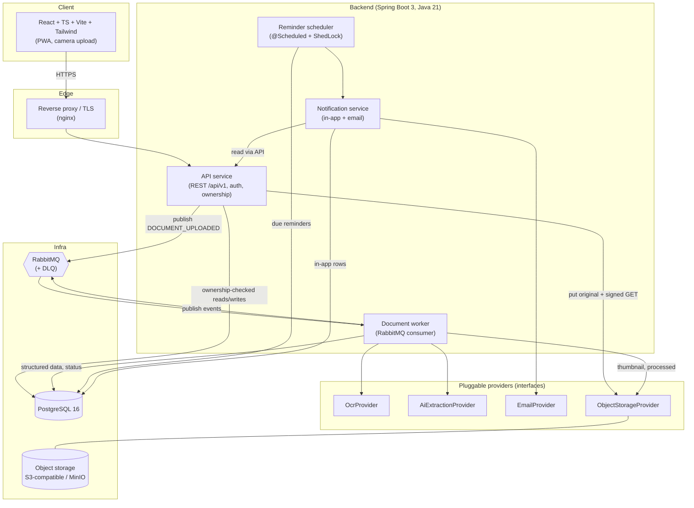
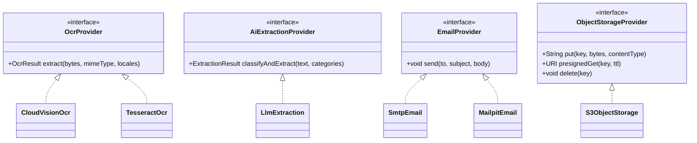
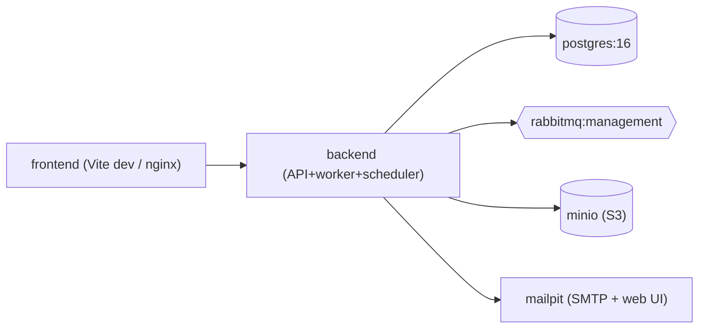

# Life Admin — System Architecture

> Deliverable **A** of spec §37. Companion to `DATA_MODEL.md`, `API_SPEC.md`,
> `PROJECT_STRUCTURE.md`, `ROADMAP.md`. Reflects the decisions in `GAPS_AND_DECISIONS.md`.

## 1. Guiding principles

- **Async by default.** Upload returns immediately; OCR + AI run on a worker (spec §21).
- **Providers behind interfaces.** OCR, AI extraction, email, and object storage are swappable
  abstractions (spec §36). No provider SDK leaks into domain/business code.
- **Ownership at the account level.** Every protected resource is checked against the caller's
  account (`GAPS_AND_DECISIONS.md` G12).
- **Uncertainty is visible.** Every extracted value carries a `source` (OCR/AI/DERIVED/USER) and
  `confidence`; nothing is auto-trusted (spec §8, §25).
- **Security is a feature.** Private storage, short-lived signed URLs, encryption in transit/at rest,
  rate limiting, audit logging (spec §18).

## 2. Component overview



### Responsibilities

| Component | Responsibility |
|-----------|----------------|
| **PWA (frontend)** | Landing, auth, dashboard, upload (incl. camera "Take Photo"), processing status, review/verify, document details, reminders, settings. Talks only to `/api/v1`. |
| **API service** | AuthN/AuthZ, all REST endpoints, ownership checks, quota enforcement, issuing short-lived signed URLs, publishing `DOCUMENT_UPLOADED`. Does **not** run OCR/AI inline. |
| **Document worker** | Consumes processing messages; runs OCR → AI extraction → date derivation → thumbnail; writes structured data + status; idempotent; retries + DLQ on failure. |
| **Reminder scheduler** | Periodically finds **due** reminders (ShedLock-guarded), triggers notifications, marks sent. |
| **Notification service** | Creates in-app `Notification` rows and sends emails via `EmailProvider`, respecting user timezone. |
| **Provider interfaces** | `OcrProvider`, `AiExtractionProvider`, `EmailProvider`, `ObjectStorageProvider` — concrete impls chosen by config/profile. |

> **Deployment note:** API, worker, scheduler, and notification service are **logical** components.
> For the MVP they can run in **one deployable** (the worker/scheduler as async beans) or be split
> into separate processes later. The message contract and ShedLock make either topology correct.

## 3. Document processing flow (happy path)

```mermaid
sequenceDiagram
    autonumber
    participant U as User (PWA)
    participant API as API service
    participant S as Object storage
    participant Q as RabbitMQ
    participant W as Document worker
    participant O as OcrProvider
    participant AI as AiExtractionProvider
    participant DB as PostgreSQL

    U->>API: POST /documents (multipart file)
    API->>API: validate MIME (magic bytes), size, quota
    API->>S: put original (server-side key)
    API->>DB: insert Document(status=UPLOADED), AuditLog
    API->>Q: publish DOCUMENT_UPLOADED {documentId, accountId, correlationId}
    API-->>U: 202 Accepted {documentId, status: UPLOADED}

    Q->>W: DOCUMENT_UPLOADED
    W->>DB: check ProcessedEvent (idempotency); set status=PROCESSING
    W->>S: get original
    W->>O: OCR(image/pdf) -> text + layout
    W->>S: store thumbnail + processed artifact
    W->>AI: extract(text, categories) -> strict JSON {type, fields, dates, actions}
    W->>W: validate JSON schema; derive dates (mark DERIVED)
    W->>DB: upsert ExtractedField(s), ImportantDate(s); set status=REVIEW_REQUIRED
    W->>Q: publish DOCUMENT_DATA_EXTRACTED
    Note over U,API: PWA polls GET /documents/{id} (or SSE later) and shows "Here's what we found"

    U->>API: POST /documents/{id}/verify (edited fields)
    API->>DB: mark fields verified; status=ACTIVE; AuditLog
    U->>API: POST /reminders {documentId, offsets}
    API->>DB: insert Reminder(s) with scheduledForUtc
```

### Failure path (summary)
On a transient error the worker retries with backoff (capped). On final failure the message is
routed to the **DLQ**, the document is set `status=FAILED` with `failureReason`, and it appears under
"Needs Attention" with a **Retry** action. Partial extraction → `REVIEW_REQUIRED`, not `FAILED`.
(`GAPS_AND_DECISIONS.md` G4.)

## 4. Reminder firing flow

```mermaid
sequenceDiagram
    autonumber
    participant SCH as Reminder scheduler
    participant L as ShedLock (DB)
    participant DB as PostgreSQL
    participant N as Notification service
    participant M as EmailProvider
    participant U as User

    Note over SCH: runs every ~5 min
    SCH->>L: acquire lock (skip if held by another instance)
    SCH->>DB: select reminders WHERE scheduledForUtc <= now() AND sentAt IS NULL
    loop each due reminder
        SCH->>N: trigger(reminder)
        N->>DB: insert Notification (unique: reminderId+channel+scheduledFor)
        N->>M: send email (user's timezone in body)
        N->>DB: mark reminder sentAt = now(); publish REMINDER_TRIGGERED
    end
    U-->>DB: GET /notifications (in-app), receives email
```

## 5. Message contract (RabbitMQ)

Events (spec §22): `DOCUMENT_UPLOADED`, `DOCUMENT_PROCESSING_STARTED`, `OCR_COMPLETED`,
`DOCUMENT_CLASSIFIED`, `DOCUMENT_DATA_EXTRACTED`, `DOCUMENT_VERIFIED`, `REMINDER_CREATED`,
`REMINDER_TRIGGERED`.

Envelope (every message):
```json
{
  "eventType": "DOCUMENT_UPLOADED",
  "eventId": "uuid-v4",
  "documentId": "uuid",
  "accountId": "uuid",
  "correlationId": "uuid",
  "timestamp": "2026-09-17T10:00:00Z"
}
```
- `eventId` drives idempotency (`ProcessedEvent`, G11).
- `correlationId` is propagated from the originating HTTP request for end-to-end tracing (G14).
- **Topology:** a main work queue + a **dead-letter exchange/queue**; consumers ack on success,
  nack→retry→DLQ on repeated failure.

## 6. Provider abstractions


Impl selection is by Spring profile / config. Local dev uses MinIO (storage) + Mailpit (email) and
can use a stub OCR/AI to keep the pipeline runnable without cloud keys. All secrets via env vars.

## 7. Local development topology (Docker Compose)


Services: `postgres`, `rabbitmq`, `minio`, `mailpit`, `backend`, `frontend`. Details in
`PROJECT_STRUCTURE.md`.

## 8. Security architecture (cross-cutting)

- **AuthN:** email/password (MVP), JWT access + refresh tokens; OAuth in Phase 2 (D2).
- **AuthZ:** every resource endpoint verifies **account ownership**; deny by default.
- **Transport/at rest:** HTTPS everywhere; storage encryption at rest; DB encrypted at rest in prod.
- **Documents:** private buckets; short-lived pre-signed URLs issued only after ownership check (G10).
- **Uploads:** magic-byte MIME validation, EXIF/GPS stripping, PDF page limits (G8).
- **Abuse:** rate limiting on auth + upload + processing (G4); audit logging of sensitive actions.
- **PII lifecycle:** hard-delete on account/document deletion across DB + storage; export-my-data
  (G5).
